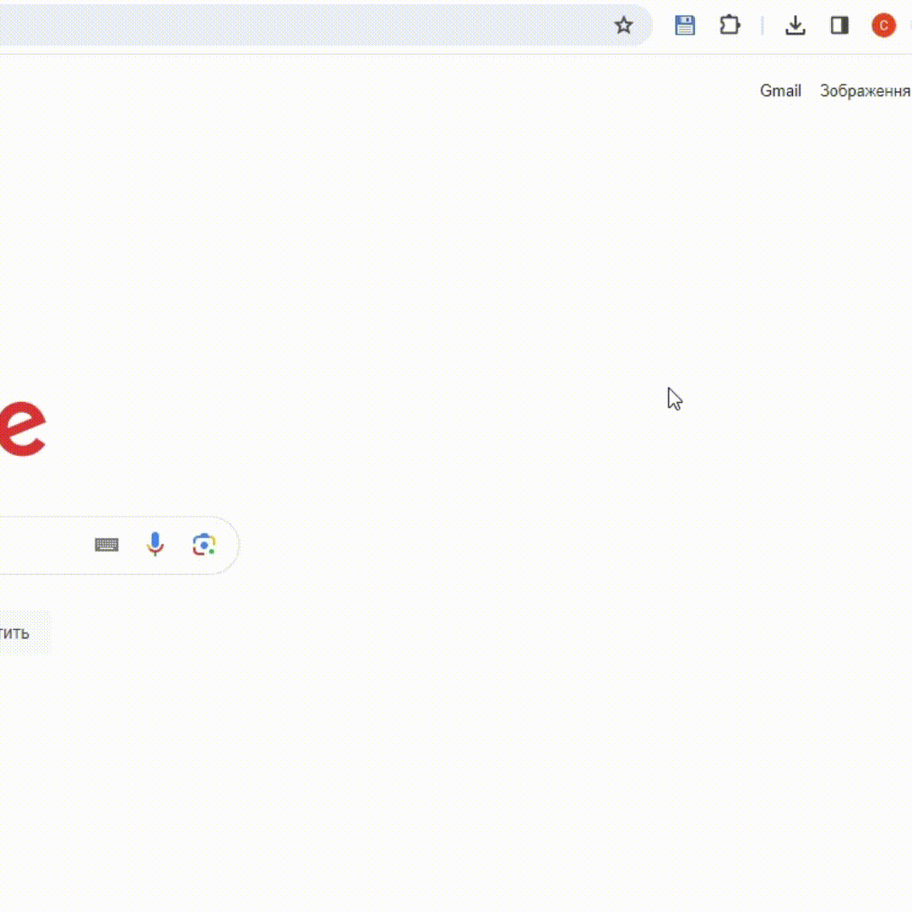

[](https://opensource.org/licenses/MIT)
[](https://developer.chrome.com/docs/extensions/reference/api/scripting)
[](https://uk.legacy.reactjs.org/)
[](https://nodejs.org/ru)
[](https://docs.nestjs.com/)


# Instagram Media Graber

**Built using React, Google Chrome Scripting API, NodeJs, NestJs & Swagger**.

This Chrome extension facilitates downloading:

- Photos from the Instagram news feed.
- Photos from user or company profiles.
- Videos from user or company profiles.
- Videos from Instagram reels.


## Features and Fuctionality

- Add save video button to DOM elements (save video)
- Add save photo button to DOM elements (save video)
- Add context menu options to save all images on the page (select and save all images)

<!--  -->

## Load extension to chrome

1. Create and set environment variables `secrets.development.js` && `secrets.production.js`

```
export default {
  serverUrl: 'ServerUrl',
  xApiKey: 'ApiKey',
};

```

2. Go to `extension` folder
3. Run build command

```
npm run build

```

4. Go to `chrome://extensions/` and click Load Unpacked
5. Load `build` folder

## Start server

1. Go to `backend-nest` folder
2. Run start command

```
npm run start:dev
```

## Contributing

Contributions are welcome! If you have any suggestions or improvements, please create a pull request. For major changes, please open an issue first to discuss the changes.

**_NOTE: PLEASE LET ME KNOW IF YOU DISCOVERED ANY BUG OR YOU HAVE ANY SUGGESTIONS_**
